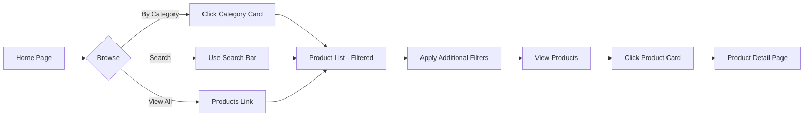
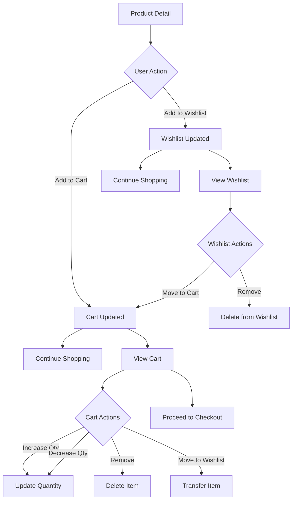
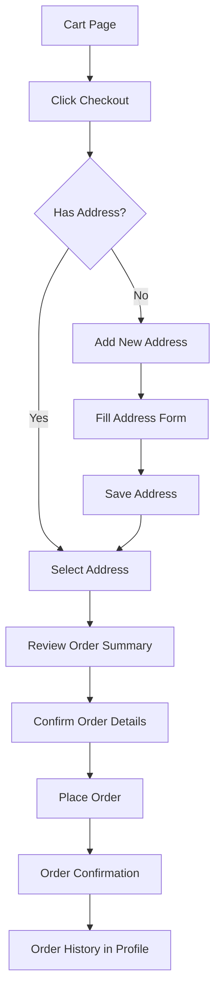

# FitFinder - Modern E-Commerce Platform


A modern, full-stack e-commerce web application built with the MERN stack, featuring a seamless shopping experience with real-time updates, responsive design, and optimized performance.

## 📑 Table of Contents

- [Overview](#overview)
- [Features](#features)
- [Architecture](#architecture)
- [Tech Stack](#tech-stack)
- [Project Structure](#project-structure)
- [Installation & Setup](#installation--setup)
- [Application Flow](#application-flow)
- [API Documentation](#api-documentation)
- [Database Schema](#database-schema)
- [State Management](#state-management)
- [Deployment](#deployment)
- [Contributing](#contributing)
- [License](#license)

---

## 🎯 Overview

**FitFinder** is a production-ready e-commerce platform designed for clothing and fashion retail. It provides a complete shopping experience from product browsing to checkout, with advanced features like wishlist management, cart operations, and user profile management.

### Key Highlights

- ✅ **Zero Page Reloads** - All actions (filters, cart, wishlist) update instantly
- ✅ **Mobile-First Responsive Design** - Perfect experience on all devices
- ✅ **Real-Time State Updates** - Instant feedback on all user actions
- ✅ **Advanced Filtering** - Category, rating, and price-based filtering
- ✅ **Optimized Performance** - Loaders only on initial page load
- ✅ **Modern UI/UX** - Clean, intuitive interface with glassmorphism effects

---

## ✨ Features

### 🛍️ Shopping Experience

- **Product Browsing**: Grid view with pagination and sorting
- **Advanced Search**: Real-time search with query parameters
- **Category Filtering**: Filter products by multiple categories
- **Rating Filter**: Minimum rating slider for quality products
- **Price Sorting**: Sort by price (Low to High / High to Low)
- **Product Details**: Comprehensive product pages with images, descriptions, sizes

### 🛒 Cart Management

- **Add to Cart**: Instant cart updates without reload
- **Quantity Control**: Increase/decrease product quantities
- **Remove Items**: Delete products from cart
- **Move to Wishlist**: Transfer items between cart and wishlist
- **Price Summary**: Real-time subtotal, shipping, and total calculation
- **Persistent Cart**: Cart state maintained across sessions

### ❤️ Wishlist

- **Save for Later**: Add products to wishlist
- **Quick Actions**: Move to cart or remove from wishlist
- **Sync Across Devices**: Wishlist persists with user account

### 👤 User Profile

- **Address Management**: Add, edit, delete multiple addresses
- **Default Address**: Select primary shipping address
- **Order History**: View past orders and status
- **Account Details**: User information display

### 📱 Responsive Design

- **Desktop Optimized**: Sidebar filters, hover effects
- **Mobile Friendly**: Collapsible filter panel, touch-optimized
- **Tablet Support**: Adaptive layouts for all screen sizes

### 🔔 User Feedback

- **Toast Notifications**: Non-intrusive success/error messages
- **Loading States**: Minimal loaders only on page initialization
- **Visual Feedback**: Button states, hover effects, animations

---

## 🏗️ Architecture

### System Architecture

```
┌─────────────────────────────────────────────────────────────┐
│                         CLIENT SIDE                          │
│  ┌────────────────────────────────────────────────────────┐ │
│  │                    React Frontend                       │ │
│  │  ┌──────────┐  ┌──────────┐  ┌──────────┐            │ │
│  │  │  Pages   │  │Components│  │  Store   │            │ │
│  │  │  - Home  │  │  - Navbar│  │ (Context)│            │ │
│  │  │  - Cart  │  │  - Cards │  │  - Cart  │            │ │
│  │  │  - Shop  │  │  - Filters│  │ -Wishlist│            │ │
│  │  └──────────┘  └──────────┘  └──────────┘            │ │
│  │         │            │              │                  │ │
│  │         └────────────┴──────────────┘                  │ │
│  │                      │                                  │ │
│  │              ┌───────▼────────┐                        │ │
│  │              │   API Layer    │                        │ │
│  │              │    (Axios)     │                        │ │
│  │              └───────┬────────┘                        │ │
│  └──────────────────────┼─────────────────────────────────┘ │
└─────────────────────────┼───────────────────────────────────┘
                          │ HTTP/REST
┌─────────────────────────▼───────────────────────────────────┐
│                       SERVER SIDE                            │
│  ┌────────────────────────────────────────────────────────┐ │
│  │              Express.js Backend                         │ │
│  │  ┌──────────┐  ┌──────────┐  ┌──────────┐            │ │
│  │  │  Routes  │→ │Controllers│→ │ Services │            │ │
│  │  │  - API   │  │ - Business│  │ - Logic  │            │ │
│  │  │  - REST  │  │  - Logic  │  │ - Fetch  │            │ │
│  │  └──────────┘  └──────────┘  └────┬─────┘            │ │
│  │                                     │                   │ │
│  │                              ┌──────▼──────┐           │ │
│  │                              │   Models    │           │ │
│  │                              │  (Mongoose) │           │ │
│  │                              └──────┬──────┘           │ │
│  └─────────────────────────────────────┼──────────────────┘ │
└─────────────────────────────────────────┼────────────────────┘
                                          │
┌─────────────────────────────────────────▼────────────────────┐
│                      MongoDB Database                         │
│  ┌──────────┐  ┌──────────┐  ┌──────────┐  ┌──────────┐   │
│  │ Products │  │Categories│  │  Orders  │  │Addresses │   │
│  └──────────┘  └──────────┘  └──────────┘  └──────────┘   │
└───────────────────────────────────────────────────────────────┘
```

### Component Architecture

```
App.jsx
├── AppLayout
│   ├── Navbar (Fixed)
│   │   ├── SearchForm
│   │   ├── Navigation Links
│   │   └── Cart/Wishlist Badges
│   ├── Main Content (Router Outlet)
│   │   ├── Home
│   │   │   ├── Hero Section
│   │   │   ├── Categories Grid
│   │   │   ├── Featured Products
│   │   │   └── New Arrivals
│   │   ├── ProductList
│   │   │   ├── FilterSidebar
│   │   │   └── ProductCard Grid
│   │   ├── ProductDetail
│   │   │   ├── Image Gallery
│   │   │   ├── Product Info
│   │   │   └── Actions (Add to Cart/Wishlist)
│   │   ├── Cart
│   │   │   ├── Cart Items List
│   │   │   └── Price Summary
│   │   ├── Wishlist
│   │   │   └── Wishlist Items Grid
│   │   ├── Profile
│   │   │   ├── User Info
│   │   │   ├── Address Management
│   │   │   └── Order History
│   │   └── Checkout
│   │       ├── Address Selection
│   │       ├── Order Summary
│   │       └── Payment
│   └── Footer
└── Global Providers
    ├── StoreProvider (Context API)
    └── ToastProvider
```

---

## 🛠️ Tech Stack

### Frontend

- **React 19.2.0** - UI library with latest features
- **React Router DOM 7.12.0** - Client-side routing
- **Bootstrap 5.3.8** - Responsive CSS framework
- **Axios 1.13.2** - HTTP client for API calls
- **Vite 7.2.4** - Fast build tool and dev server
- **Context API** - Global state management

### Backend

- **Node.js** - JavaScript runtime
- **Express.js 5.2.1** - Web application framework
- **MongoDB** - NoSQL database
- **Mongoose 9.1.4** - MongoDB object modeling
- **CORS 2.8.5** - Cross-origin resource sharing
- **Dotenv 17.2.3** - Environment variable management
- **Morgan 1.10.1** - HTTP request logger

### DevOps & Deployment

- **Vercel** - Frontend hosting
- **MongoDB Atlas** - Database hosting
- **Git & GitHub** - Version control
- **nodemon** - Development auto-restart

---

## 📁 Project Structure

```
MajorPrBackEnd/
│
├── backend/
│   ├── src/
│   │   ├── app.js                 # Express app configuration
│   │   ├── server.js              # Server entry point
│   │   ├── seed.js                # Database seeding script
│   │   │
│   │   ├── config/
│   │   │   └── db.js              # MongoDB connection
│   │   │
│   │   ├── models/
│   │   │   ├── Product.js         # Product schema
│   │   │   ├── Category.js        # Category schema
│   │   │   ├── Order.js           # Order schema
│   │   │   ├── Address.js         # Address schema
│   │   │   ├── Cart.js            # Cart schema
│   │   │   └── Wishlist.js        # Wishlist schema
│   │   │
│   │   ├── controllers/
│   │   │   ├── products.controller.js
│   │   │   ├── categories.controller.js
│   │   │   ├── orders.controller.js
│   │   │   ├── addresses.controller.js
│   │   │   ├── cart.controller.js
│   │   │   └── wishlist.controller.js
│   │   │
│   │   ├── services/
│   │   │   ├── products.service.js
│   │   │   ├── categories.service.js
│   │   │   ├── orders.service.js
│   │   │   ├── addresses.service.js
│   │   │   ├── cart.service.js
│   │   │   └── wishlist.service.js
│   │   │
│   │   ├── routes/
│   │   │   ├── products.routes.js
│   │   │   ├── categories.routes.js
│   │   │   ├── orders.routes.js
│   │   │   ├── addresses.routes.js
│   │   │   ├── cart.routes.js
│   │   │   └── wishlist.routes.js
│   │   │
│   │   └── middlewares/
│   │       ├── asyncWrap.js       # Async error wrapper
│   │       ├── errorHandler.js    # Global error handler
│   │       ├── notFound.js        # 404 handler
│   │       └── demoUser.js        # Demo user middleware
│   │
│   ├── package.json
│   ├── .env                       # Environment variables
│   └── .gitignore
│
├── frontend/
│   └── clothingClientSide/
│       ├── public/
│       │   └── vite.svg
│       │
│       ├── src/
│       │   ├── main.jsx           # App entry point
│       │   ├── App.jsx            # Root component
│       │   ├── index.css          # Global styles
│       │   │
│       │   ├── components/
│       │   │   ├── common/
│       │   │   │   ├── Loader.jsx
│       │   │   │   └── Toast.jsx
│       │   │   ├── layout/
│       │   │   │   ├── AppLayout.jsx
│       │   │   │   ├── Navbar.jsx
│       │   │   │   └── Footer.jsx
│       │   │   └── product/
│       │   │       ├── ProductCard.jsx
│       │   │       └── FilterSidebar.jsx
│       │   │
│       │   ├── pages/
│       │   │   ├── Home.jsx
│       │   │   ├── ProductList.jsx
│       │   │   ├── ProductDetail.jsx
│       │   │   ├── Cart.jsx
│       │   │   ├── Wishlist.jsx
│       │   │   ├── Profile.jsx
│       │   │   └── Checkout.jsx
│       │   │
│       │   ├── store/
│       │   │   ├── store.js       # State management logic
│       │   │   ├── storeProvider.jsx
│       │   │   └── toastProvider.jsx
│       │   │
│       │   └── api/
│       │       ├── http.js        # Axios configuration
│       │       ├── products.api.js
│       │       ├── categories.api.js
│       │       └── orders.api.js
│       │
│       ├── index.html
│       ├── package.json
│       ├── vite.config.js
│       ├── vercel.json            # Vercel deployment config
│       └── .gitignore
│
└── README.md                      # This file
```

---

## 🚀 Installation & Setup

### Prerequisites

- Node.js (v18 or higher)
- npm or yarn
- MongoDB (local or Atlas account)
- Git

### Backend Setup

1. **Clone the repository**

   ```bash
   git clone https://github.com/Shams261/ThreadFlow.git
   cd MajorPrBackEnd/backend
   ```

2. **Install dependencies**

   ```bash
   npm install
   ```

3. **Configure environment variables**

   Create a `.env` file in the `backend` directory:

   ```env
   PORT=3000
   MONGODB_URI=mongodb://localhost:27017/fitfinder
   # OR for MongoDB Atlas:
   # MONGODB_URI=mongodb+srv://<username>:<password>@cluster.mongodb.net/fitfinder
   NODE_ENV=development
   ```

4. **Seed the database** (Optional)

   ```bash
   npm run seed
   ```

5. **Start the development server**

   ```bash
   npm run dev
   ```

   Backend will run on `http://localhost:3000`

### Frontend Setup

1. **Navigate to frontend directory**

   ```bash
   cd ../frontend/clothingClientSide
   ```

2. **Install dependencies**

   ```bash
   npm install
   ```

3. **Configure API endpoint**

   Update `src/api/http.js` if needed:

   ```javascript
   const API_BASE_URL = "http://localhost:3000";
   ```

4. **Start the development server**

   ```bash
   npm run dev
   ```

   Frontend will run on `http://localhost:5173`

### Access the Application

Open your browser and navigate to:

```
http://localhost:5173
```

---

## 🔄 Application Flow

### 1. **User Journey: Product Discovery**



**Detailed Steps:**

1. **Landing on Home Page**
   - Hero section displays with current collection
   - Featured products carousel
   - Category grid shows all available categories
   - New arrivals section

2. **Category Selection**
   - User clicks on a category (e.g., "Men")
   - URL updates to `/products?category=cat-men`
   - ProductList page loads with category filter pre-applied
   - Only products from selected category display

3. **Search Functionality**
   - User types in navbar search (available on all pages)
   - Navigates to `/products?search=query`
   - Products filtered by search term in title/description

4. **Filter Application**
   - Desktop: Sidebar always visible
   - Mobile: Collapsible filter panel
   - Filters include:
     - Category (multi-select checkboxes)
     - Minimum Rating (slider)
     - Price Sort (Low to High / High to Low)
   - **No page reload** - instant updates

### 2. **User Journey: Shopping**



**Detailed Steps:**

1. **Product Detail Page**
   - Full product information display
   - Image, title, brand, price, discount
   - Size selection
   - Stock availability
   - Rating and reviews count
   - Actions: Add to Cart, Add to Wishlist

2. **Add to Cart Flow**

   ```javascript
   User clicks "Add to Cart"
   ↓
   dispatch({ type: ACTIONS.CART_ADD, payload: productId })
   ↓
   Global state updates (Context API)
   ↓
   Cart count in navbar updates (+1)
   ↓
   Toast notification: "Added to cart ✅"
   ↓
   NO PAGE RELOAD
   ```

3. **Cart Management**
   - View all cart items with images
   - Quantity controls: +/- buttons
   - Remove item button
   - Move to wishlist option
   - Real-time price calculation:
     - Subtotal (sum of all items)
     - Shipping (FREE or calculated)
     - Total
   - All actions update instantly without reload

4. **Wishlist Management**
   - Save products for later
   - Quick move to cart
   - Remove from wishlist
   - Grid view of saved products

### 3. **User Journey: Checkout**



**Detailed Steps:**

1. **Address Management**
   - View all saved addresses
   - Add new address (form with validation)
   - Edit existing address
   - Delete address
   - Select default shipping address
   - Address fields:
     - Name
     - Phone
     - Address Line 1
     - City
     - State
     - Pincode
     - Country

2. **Order Review**
   - Display selected address
   - List all cart items
   - Show quantities
   - Calculate final pricing:
     - Item subtotal
     - Shipping charges
     - Tax (if applicable)
     - Grand total

3. **Order Placement**
   - Validate address selection
   - Create order in database
   - Clear cart
   - Show success message
   - Redirect to order confirmation

4. **Post-Order**
   - Order appears in profile history
   - Order details viewable
   - Status tracking (pending/completed)

---

## 🔌 API Documentation

### Base URL

```
http://localhost:3000
```

### Products API

#### Get All Products

```http
GET /products
```

Query Parameters:

- `search` (string): Search in title/description
- `categoryIds` (string): Comma-separated category IDs
- `minRating` (number): Minimum rating filter
- `sort` (string): "LOW_TO_HIGH" or "HIGH_TO_LOW"

Example:

```http
GET /products?search=shirt&categoryIds=cat-men&minRating=4&sort=LOW_TO_HIGH
```

Response:

```json
[
  {
    "_id": "prod-1",
    "title": "Classic Cotton T-Shirt",
    "brand": "FitFinder",
    "price": 599,
    "originalPrice": 999,
    "discountPercent": 40,
    "rating": 4.5,
    "ratingCount": 120,
    "images": ["url1.jpg", "url2.jpg"],
    "sizes": ["S", "M", "L", "XL"],
    "inStock": true,
    "stockQty": 50,
    "categoryId": "cat-men",
    "description": "Comfortable cotton t-shirt...",
    "createdAt": "2026-01-01T00:00:00.000Z"
  }
]
```

#### Get Product by ID

```http
GET /products/:id
```

Response: Single product object

### Categories API

#### Get All Categories

```http
GET /categories
```

Response:

```json
[
  {
    "_id": "cat-men",
    "name": "Men",
    "description": "Men's clothing collection"
  },
  {
    "_id": "cat-women",
    "name": "Women",
    "description": "Women's fashion wear"
  }
]
```

### Orders API

#### Get User Orders

```http
GET /orders
```

Response:

```json
[
  {
    "_id": "order-1",
    "items": [
      {
        "productId": "prod-1",
        "qty": 2,
        "price": 599
      }
    ],
    "address": {
      "name": "John Doe",
      "phone": "1234567890",
      "line1": "123 Main St",
      "city": "Mumbai",
      "state": "Maharashtra",
      "pincode": "400001"
    },
    "subtotal": 1198,
    "shipping": 0,
    "tax": 60,
    "total": 1258,
    "status": "pending",
    "createdAt": "2026-01-15T10:30:00.000Z"
  }
]
```

#### Create Order

```http
POST /orders
```

Request Body:

```json
{
  "items": [
    {
      "productId": "prod-1",
      "qty": 2,
      "price": 599
    }
  ],
  "addressId": "addr-1"
}
```

Response: Created order object

### Addresses API

#### Get User Addresses

```http
GET /addresses
```

#### Add Address

```http
POST /addresses
```

Request Body:

```json
{
  "name": "John Doe",
  "phone": "1234567890",
  "line1": "123 Main St",
  "city": "Mumbai",
  "state": "Maharashtra",
  "pincode": "400001",
  "country": "India"
}
```

#### Update Address

```http
PUT /addresses/:id
```

#### Delete Address

```http
DELETE /addresses/:id
```

---

## 🗄️ Database Schema

### Product Schema

```javascript
{
  _id: ObjectId,
  title: String (required),
  brand: String,
  price: Number (required),
  originalPrice: Number,
  discountPercent: Number,
  rating: Number (default: 0),
  ratingCount: Number (default: 0),
  images: [String],
  sizes: [String],
  inStock: Boolean (default: true),
  stockQty: Number,
  categoryId: String (ref: Category),
  description: String,
  createdAt: Date,
  updatedAt: Date
}
```

### Category Schema

```javascript
{
  _id: String (custom ID like "cat-men"),
  name: String (required, unique),
  description: String,
  createdAt: Date
}
```

### Order Schema

```javascript
{
  _id: ObjectId,
  userId: String (optional for demo),
  items: [{
    productId: ObjectId (ref: Product),
    qty: Number,
    price: Number
  }],
  address: {
    name: String,
    phone: String,
    line1: String,
    city: String,
    state: String,
    pincode: String,
    country: String
  },
  subtotal: Number,
  shipping: Number,
  tax: Number,
  total: Number,
  status: String (enum: pending, completed, cancelled),
  createdAt: Date,
  updatedAt: Date
}
```

### Address Schema

```javascript
{
  _id: ObjectId,
  userId: String (optional for demo),
  name: String (required),
  phone: String (required),
  line1: String (required),
  city: String (required),
  state: String (required),
  pincode: String (required),
  country: String (default: "India"),
  isDefault: Boolean (default: false),
  createdAt: Date
}
```

---

## 🔐 State Management

### Context API Structure

```javascript
// Global State Shape
{
  cart: {
    items: {
      "prod-1": 2,  // productId: quantity
      "prod-2": 1
    }
  },
  wishlist: {
    ids: ["prod-3", "prod-4"]  // Array of product IDs
  },
  addresses: {
    list: [/* address objects */],
    selectedId: "addr-1"
  }
}
```

### Actions

```javascript
// Cart Actions
ACTIONS.CART_ADD; // Add product to cart (qty = 1)
ACTIONS.CART_INC; // Increase quantity by 1
ACTIONS.CART_DEC; // Decrease quantity by 1 (remove if qty = 1)
ACTIONS.CART_REMOVE; // Remove product completely
ACTIONS.CART_CLEAR; // Clear entire cart

// Wishlist Actions
ACTIONS.WISHLIST_TOGGLE; // Add/remove from wishlist
ACTIONS.MOVE_WISHLIST_TO_CART; // Move item to cart
ACTIONS.MOVE_CART_TO_WISHLIST; // Move item to wishlist

// Address Actions
ACTIONS.ADDRESS_ADD; // Add new address
ACTIONS.ADDRESS_UPDATE; // Update existing address
ACTIONS.ADDRESS_DELETE; // Delete address
ACTIONS.ADDRESS_SELECT; // Set as selected/default
```

### State Persistence

```javascript
// localStorage keys
-"fitfinder_cart" - // Cart state
  "fitfinder_wishlist" - // Wishlist state
  "fitfinder_addresses"; // Addresses state

// On app load: Restore from localStorage
// On state change: Save to localStorage
```

---

## 🎨 Design System

### Colors

```css
--primary-brand: #0d6efd --primary-soft: #e0ebff --text-main: #111827
  --text-muted: #6b7280 --bg-page: #f5f5f7 --bg-elevated: #ffffff
  --border-subtle: #e5e7eb;
```

### Typography

- **Font Family**: Inter, system-ui, sans-serif
- **Headings**: Bold, varying sizes
- **Body**: Regular 400, 16px base

### Components

**Buttons**

- Primary: `.btn-dark`
- Secondary: `.btn-outline-dark`
- Small: `.btn-sm`

**Cards**

- Shadow: `box-shadow: 0 2px 8px rgba(0,0,0,0.1)`
- Border radius: `8px`
- Hover effect: `translateY(-4px)`

**Navbar**

- Fixed position with glassmorphism
- Backdrop filter blur
- z-index: 1030

---

## 📱 Responsive Breakpoints

```css
/* Mobile First Approach */
Base: 0px - 575px       (Mobile)
sm: 576px - 767px       (Large Mobile)
md: 768px - 991px       (Tablet)
lg: 992px - 1199px      (Desktop)
xl: 1200px+             (Large Desktop)
```

### Responsive Features

**Mobile (<992px)**

- Collapsible filter panel with toggle button
- Stacked layout for cart items
- Full-width buttons
- Hamburger menu for navigation

**Desktop (≥992px)**

- Permanent filter sidebar
- Grid layout for products (3-4 columns)
- Side-by-side cart and price summary
- Hover effects on cards

---

## 🚢 Deployment

### Frontend (Vercel)

1. **Install Vercel CLI** (optional)

   ```bash
   npm install -g vercel
   ```

2. **Deploy**

   ```bash
   cd frontend/clothingClientSide
   vercel --prod
   ```

3. **Auto-deployment**
   - Connect GitHub repository to Vercel
   - Push to `main` branch triggers deployment
   - Build command: `npm run build`
   - Output directory: `dist`

### Backend

**Option 1: Render / Railway**

1. Connect GitHub repository
2. Set environment variables
3. Deploy from `backend` directory

**Option 2: Heroku**

```bash
heroku create fitfinder-api
git subtree push --prefix backend heroku main
```

**Option 3: DigitalOcean / AWS**

- Set up Node.js server
- Install dependencies
- Use PM2 for process management
- Configure nginx as reverse proxy

### Database (MongoDB Atlas)

1. Create cluster at mongodb.com/atlas
2. Whitelist IP addresses
3. Create database user
4. Get connection string
5. Update `.env` file

---

## 🧪 Testing

### Manual Testing Checklist

**Home Page**

- [ ] Hero section loads
- [ ] Categories display correctly
- [ ] Featured products show
- [ ] Category click navigates to filtered products

**Product List**

- [ ] Products load initially
- [ ] Filters apply without reload
- [ ] Search works correctly
- [ ] Sort functions properly
- [ ] Mobile filter panel toggles

**Product Detail**

- [ ] Product information displays
- [ ] Add to cart works
- [ ] Add to wishlist works
- [ ] No page reload on actions

**Cart**

- [ ] Items display correctly
- [ ] Quantity increase/decrease works
- [ ] Remove item works
- [ ] Move to wishlist works
- [ ] Price updates in real-time
- [ ] No loader on actions

**Wishlist**

- [ ] Items display
- [ ] Move to cart works
- [ ] Remove works
- [ ] No loader on actions

**Profile**

- [ ] Address list displays
- [ ] Add address works
- [ ] Edit address works
- [ ] Delete address works
- [ ] Order history shows

**Responsive**

- [ ] Mobile view correct
- [ ] Tablet view correct
- [ ] Desktop view correct
- [ ] Touch targets adequate

---

## 🐛 Common Issues & Solutions

### Issue: MongoDB Connection Failed

**Solution:**

- Check MongoDB is running: `mongod --version`
- Verify connection string in `.env`
- For Atlas: Check IP whitelist

### Issue: Frontend not connecting to Backend

**Solution:**

- Verify backend is running on correct port
- Check CORS configuration in `backend/src/app.js`
- Update API base URL in `frontend/src/api/http.js`

### Issue: Products not loading

**Solution:**

- Check database has seeded data: `npm run seed`
- Verify API endpoint returns data
- Check browser console for errors

### Issue: State not persisting

**Solution:**

- Check localStorage is enabled
- Clear browser cache
- Verify state persistence logic in store

---

## 📝 Future Enhancements

### Planned Features

- [ ] User authentication (Login/Register)
- [ ] Payment gateway integration
- [ ] Product reviews and ratings
- [ ] Order tracking
- [ ] Email notifications
- [ ] Product recommendations
- [ ] Coupon/discount codes
- [ ] Multi-currency support
- [ ] Social media sharing
- [ ] Admin dashboard
- [ ] Inventory management
- [ ] Analytics dashboard

### Technical Improvements

- [ ] Add unit tests (Jest/Vitest)
- [ ] Add E2E tests (Cypress/Playwright)
- [ ] Implement caching (Redis)
- [ ] Add image optimization
- [ ] Implement lazy loading
- [ ] Add PWA support
- [ ] SEO optimization
- [ ] Performance monitoring
- [ ] Error tracking (Sentry)
- [ ] API rate limiting

---

## 🤝 Contributing

We welcome contributions! Please follow these guidelines:

1. **Fork the repository**
2. **Create a feature branch**
   ```bash
   git checkout -b feature/amazing-feature
   ```
3. **Make your changes**
4. **Commit with clear messages**
   ```bash
   git commit -m "Add: Amazing new feature"
   ```
5. **Push to your branch**
   ```bash
   git push origin feature/amazing-feature
   ```
6. **Open a Pull Request**

### Commit Message Convention

- `Add:` New feature
- `Fix:` Bug fix
- `Update:` Modify existing feature
- `Refactor:` Code restructuring
- `Docs:` Documentation changes
- `Style:` Code formatting

---

## 📄 License

This project is licensed under the MIT License.

```
MIT License

Copyright (c) 2026 Shams Tabrez

Permission is hereby granted, free of charge, to any person obtaining a copy
of this software and associated documentation files (the "Software"), to deal
in the Software without restriction, including without limitation the rights
to use, copy, modify, merge, publish, distribute, sublicense, and/or sell
copies of the Software, and to permit persons to whom the Software is
furnished to do so, subject to the following conditions:

The above copyright notice and this permission notice shall be included in all
copies or substantial portions of the Software.

THE SOFTWARE IS PROVIDED "AS IS", WITHOUT WARRANTY OF ANY KIND, EXPRESS OR
IMPLIED, INCLUDING BUT NOT LIMITED TO THE WARRANTIES OF MERCHANTABILITY,
FITNESS FOR A PARTICULAR PURPOSE AND NONINFRINGEMENT.
```

---

## 👨‍💻 Author

**Shams Tabrez**

- GitHub: [@Shams261](https://github.com/Shams261)
- Email: shamsshoaib261@gmail.com
- LinkedIn: [Your LinkedIn]

---

## 🙏 Acknowledgments

- React Team for the amazing library
- Bootstrap for the UI framework
- MongoDB for the database
- Vercel for hosting
- All open-source contributors

---

## 📞 Support

For support, email shamsshoaib261@gmail.com or open an issue on GitHub.

---

**⭐ If you found this project helpful, please give it a star!**

---

_Last Updated: January 21, 2026_
